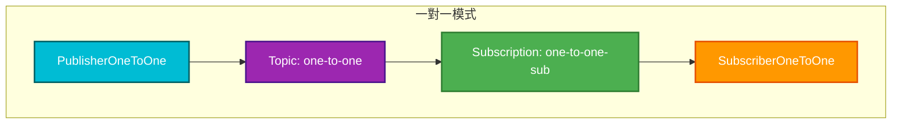
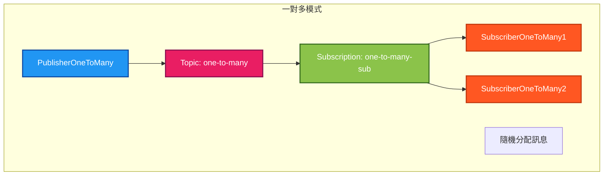
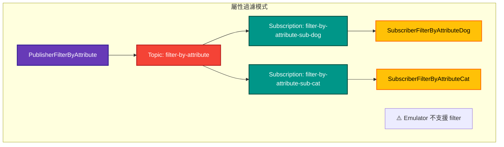
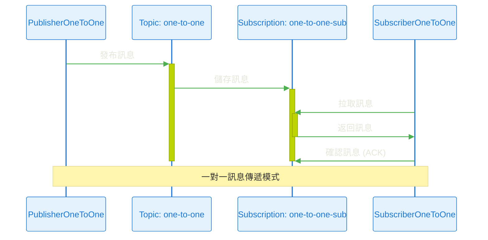
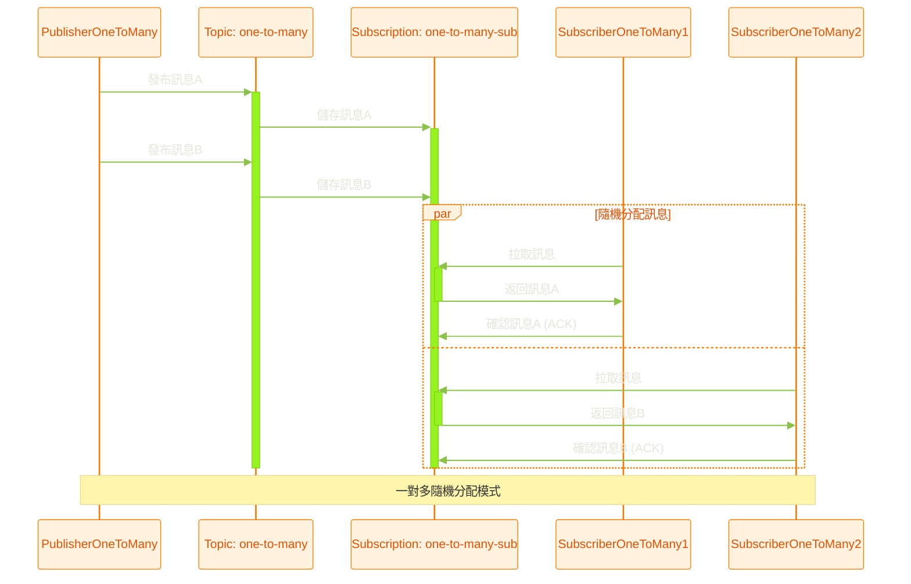
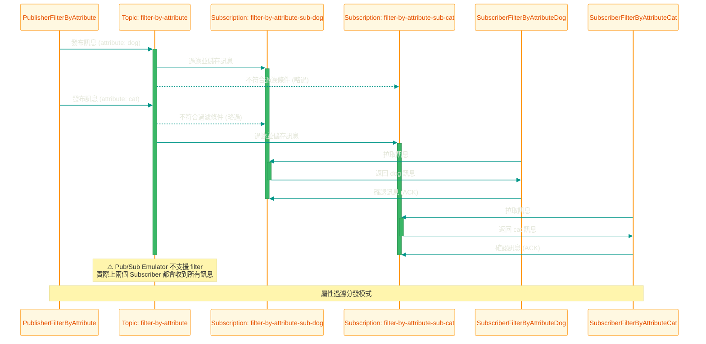

# README

# Docker 環境建立

執行 Docker Compose

```bash
$ docker compose -f docker-compose.yaml -p gcp-emulators-poc up -d

# 重新編譯相依服務 Image
$ docker compose -f docker-compose.yaml -p gcp-emulators-poc up -d --build
```

# Resources 管理

- 需要先建立 Topic，並且建立對應的 Subscription，才能進行訊息的發布與拉取

## Topics

```bash
# 建立 Topic
$ curl -X PUT http://localhost:8086/v1/projects/test-project/topics/test-topic

# 查詢所有 Topics
$ curl -s "http://localhost:8086/v1/projects/test-project/topics" | jq

# 查詢指定 Topic 是否存在
$ curl -s "http://localhost:8086/v1/projects/test-project/topics/test-topic" | jq

# 刪除 Topic
$ curl -X DELETE http://localhost:8086/v1/projects/test-project/topics/test-topic

# 發布訊息
$ curl -X POST http://localhost:8086/v1/projects/test-project/topics/test-topic:publish \
  -H "Content-Type: application/json" \
  -d '{
        "messages": [
          { "data": "'$(echo -n "hello emulator" | base64)'" }
        ]
      }'
```

## Subscriptions

```bash
# 建立 Subscription, 並指定 ackDeadlineSeconds
$ curl -X PUT http://localhost:8086/v1/projects/test-project/subscriptions/test-subscription \
  -H "Content-Type: application/json" \
  -d '{
        "topic": "projects/test-project/topics/test-topic",
        "ackDeadlineSeconds": 60
      }'

# 查詢所有 Subscriptions
$ curl -s "http://localhost:8086/v1/projects/test-project/subscriptions" | jq

# 查詢指定 Subscription 是否存在
$ curl -s "http://localhost:8086/v1/projects/test-project/subscriptions/test-subscription" | jq

# 刪除 Subscription
$ curl -X DELETE http://localhost:8086/v1/projects/test-project/subscriptions/test-subscription

# 拉取訊息
$ curl -s -X POST http://localhost:8086/v1/projects/test-project/subscriptions/test-subscription:pull \
  -H "Content-Type: application/json" \
  -d '{
        "maxMessages": 1
      }'

# 確認訊息 (ACK)
$ curl -X POST http://localhost:8086/v1/projects/test-project/subscriptions/test-subscription:35
```

# Publisher/Subscriber

## 架構概覽

以下是本專案中實作的三種 Publisher/Subscriber 模式：







## 一對一

**模式說明：** 一個發布者對應一個訂閱者，訊息直接傳遞



- PublisherOneToOne
- SubscriberOneToOne
  - subscription: `one-to-one-sub`

```bash
# 建立 Topic
$ curl -X PUT http://localhost:8086/v1/projects/test-project/topics/one-to-one

# 建立 Subscription
$ curl -X PUT http://localhost:8086/v1/projects/test-project/subscriptions/one-to-one-sub \
  -H "Content-Type: application/json" \
  -d '{
        "topic": "projects/test-project/topics/one-to-one"
      }'
```

## 一對多

**模式說明：** 一個發布者對應多個訂閱者，同一個訂閱共享相同的 Subscription，訊息會隨機分配



- PublisherOneToMany
- SubscriberOneToMany1
  - subscription: `one-to-many-sub`
- SubscriberOneToMany2
  - subscription: `one-to-many-sub`
- 隨機分配訊息給 Subscriber

```bash
# 建立 Topic
$ curl -X PUT http://localhost:8086/v1/projects/test-project/topics/one-to-many

# 建立 Subscription
$ curl -X PUT http://localhost:8086/v1/projects/test-project/subscriptions/one-to-many-sub \
  -H "Content-Type: application/json" \
  -d '{
        "topic": "projects/test-project/topics/one-to-many"
      }'
```

## Filter by attribute

**模式說明：** 基於訊息屬性進行過濾，不同的訂閱者只接收符合條件的訊息



- PublisherFilterByAttribute
- SubscriberFilterByAttributeDog
  - subscription: `filter-by-attribute-sub-dog`
- SubscriberFilterByAttributeCat
  - subscription: `filter-by-attribute-sub-cat`
- Pub/Sub Emulator 不支援 filter 功能，導致兩個 Subscriber 都會收到所有訊息

```bash
# 建立 Topic
$ curl -X PUT http://localhost:8086/v1/projects/test-project/topics/filter-by-attribute

# 建立 Subscription (filter by attributes.dog)
$ curl -X PUT http://localhost:8086/v1/projects/test-project/subscriptions/filter-by-attribute-sub-dog \
  -H "Content-Type: application/json" \
  -d '{
        "topic": "projects/test-project/topics/filter-by-attribute",
        "filter": "attributes.partition_key = \"dog\""
      }'

# 建立 Subscription (filter by attributes.cat)
$ curl -X PUT http://localhost:8086/v1/projects/test-project/subscriptions/filter-by-attribute-sub-cat \
  -H "Content-Type: application/json" \
  -d '{
        "topic": "projects/test-project/topics/filter-by-attribute",
        "filter": "attributes.partition_key = \"cat\""
      }'
```
